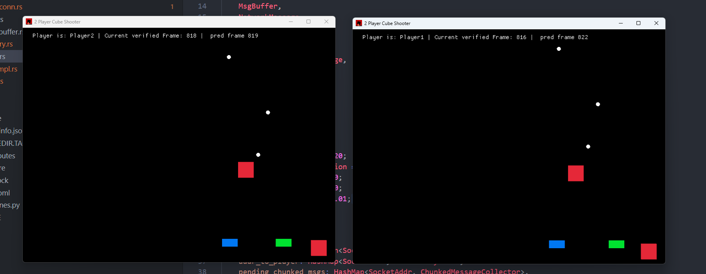

# UnlockRS

UnlockRS is a real-time networked multiplayer game using UDP. The project implements a verified vs predicted simulation model with a relay server.

## Key Features

- **Deterministic Simulation**: The simulation is designed to be deterministic, allowing it to run the same way on both clients using only player inputs.
- **Verified vs Predicted Simulation**: This model enhances gameplay by running 2 simulations, one that has to be deterministic which is going to be checked for synchronization and only runs when other player inputs have been received, and a predicted simulation based on the last verified inputs, to enable more responsiveness.
- **Relay Server**: The relay server facilitates communication between clients and can be expanded to handle synchronization (using state checksums).
- **Memory Allocator**: A custom allocator built on top of Vec<u8> has been used to easily transfer state between both simulations.
- **UDP**: Inputs are buffered and sent as a buffer every frame until an acknowledgement for a frame is received, then all previous inputs (all inputs with frame_num < ack frame_num) will be discarded.
